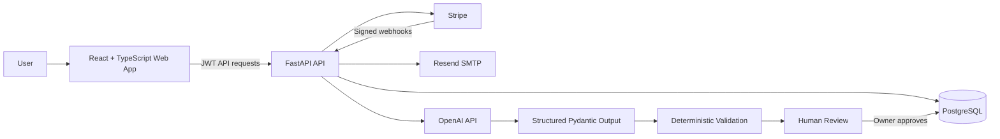

# Chorevera

**Production full-stack household management SaaS with AI-assisted planning, subscriptions, multi-user households, notifications, analytics, and secure cloud persistence.**

> Chorevera is a portfolio project built to demonstrate production-oriented full-stack and AI application engineering—not just a local tutorial or standalone prompt demo.

## Live Demo

- Web app: https://choreflow-web.onrender.com
- API health: https://choreflow-api-cndf.onrender.com/api/v1/health

> The Render service URLs retain the project's earlier internal name. The public product name is **Chorevera**.

## What Chorevera Does

Chorevera helps households coordinate recurring work and shared responsibilities. Users can create chores, manage households, invite members, assign and rebalance work, track progress, receive notifications, and manage paid plans.

The AI Household Planner extends the product with a guarded AI workflow: it combines a natural-language household goal with current relational application context, generates a structured proposal, validates that proposal against deterministic business rules, and requires explicit owner approval before any database mutation.

## Highlights

- Secure account registration, login, email verification, and password reset
- JWT authentication with token-version invalidation
- Personal and shared household chores
- Household invitations, membership, and owner permissions
- Chore assignment, reassignment, completion, reopen, and deletion workflows
- Persistent notifications and household activity history
- Daily progress, streaks, weekly insights, leaderboards, and achievements
- Deterministic workload auto-assignment
- AI Household Planner using structured model output and server-side validation
- Human approval boundary before AI-generated changes are applied
- Free, Pro, and Family subscriptions
- Stripe Checkout, Billing Portal, and signed webhook synchronization
- Transactional email delivery
- PostgreSQL production persistence
- Alembic database migrations
- Rate limiting, security headers, trusted-host/CORS controls, and security audit logging
- Automated backend regression tests
- Production deployment on Render
- Database recovery and logical backup workflow
- Privacy, Terms, and Support pages

## Tech Stack

### Frontend
- React
- TypeScript
- Vite
- Lucide React
- Fetch-based authenticated API client

### Backend
- Python
- FastAPI
- SQLModel / SQLAlchemy
- Pydantic
- JWT
- OpenAI Python SDK

### Data & Infrastructure
- PostgreSQL
- Alembic
- Render
- GitHub
- Stripe Billing
- Resend SMTP

## AI Household Planner

The AI Planner is designed as an **AI-assisted decision system**, not an unrestricted chatbot.

A user can request something like:

> We have guests coming Saturday. Get the kitchen, bathrooms, laundry, and living room done beforehand and divide the work fairly.

The planner:

1. Authenticates the user and checks their AI entitlement.
2. Loads only the household context needed for planning.
3. Sends the user's goal plus current household context to the model.
4. Parses the response into a typed Pydantic schema.
5. Validates member IDs, chore IDs, duplicate actions, and current state.
6. Shows the proposal without modifying the database.
7. Requires explicit household-owner approval to apply it.
8. Revalidates against fresh database state before mutation.
9. Falls back to deterministic workload balancing if the AI provider is unavailable or returns unusable output.

### AI Safety Boundaries

- AI cannot delete chores through the planner.
- AI cannot modify completed chores.
- AI cannot assign work to a user outside the household.
- AI cannot reference stale or unrelated chores.
- Email addresses, password hashes, payment data, tokens, and API credentials are excluded from model context.
- All writes require authenticated owner approval.
- Generate/apply endpoints are rate limited.

## Architecture



## Production Engineering Work

This project includes engineering work that typically appears only after an application leaves localhost:

- SQLite-to-PostgreSQL migration with legacy foreign-key repair
- Production Alembic migration handling
- Stripe live/test environment separation
- Signed Stripe webhook verification
- Subscription state synchronization
- Production SMTP configuration
- CORS and trusted-host configuration
- Rate limiting and security audit logs
- Frontend production TypeScript build fixes
- Single-page-app route rewrites on Render
- Logical database backups and point-in-time recovery
- Dependency vulnerability remediation
- Automated regression testing and production health checks

## Repository Structure

```text
apps/
  api/
    app/
      models/
      routes/
      schemas/
      services/
    alembic/
    scripts/
    tests/
  web/
    src/
      api/
      components/
      context/
      pages/
      types/
docs/
```

## Local Development

### API

```powershell
cd apps\api
python -m pip install -r requirements.txt
python -m uvicorn app.main:app --reload
```

### Frontend

```powershell
cd apps\web
npm install
npm run dev
```

## Tests

```powershell
cd apps\api
python -m pytest -q
```

The AI planner also has focused semantic-validation regression tests and an evaluation script for representative household-planning scenarios.

## What I Learned

Building Chorevera required more than implementing UI features. The project involved designing authorization boundaries, relational data models, subscription state synchronization, migrations, production incident debugging, AI validation, deployment configuration, and recovery procedures.

The largest lesson was that a production AI feature needs more than a prompt: it needs **context control, structured outputs, deterministic validation, authorization, graceful failure behavior, observability, and a human approval boundary**.

## Portfolio Focus

Chorevera demonstrates skills relevant to:

- Full-Stack Software Engineering
- Backend Engineering
- Python / FastAPI Engineering
- AI Application Engineering
- Applied AI / LLM Engineering
- SaaS Product Engineering

## Author

**John Marshall Treen**

GitHub: https://github.com/Sundog28

---

This repository is a portfolio project and is under active development.
